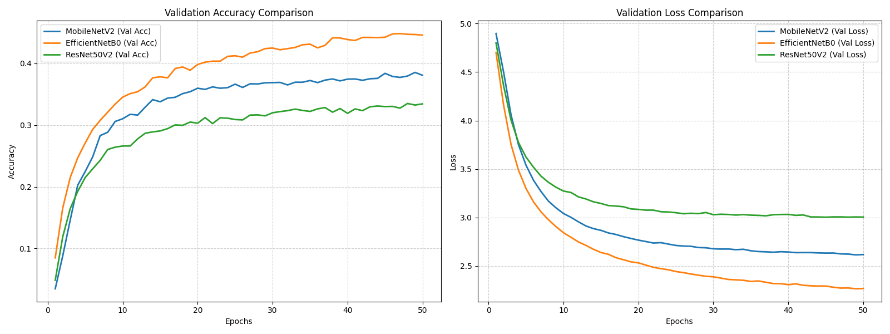

# แพลตฟอร์มตรวจสอบเอกลักษณ์พรรณไม้ท้องถิ่น จังหวัดปทุมธานี (Deep Learning & Knowledge Management)

โครงการวิจัยนี้มีวัตถุประสงค์เพื่อออกแบบและพัฒนาแพลตฟอร์มสำหรับตรวจสอบเอกลักษณ์ของพรรณไม้ในกลุ่มพืชที่มีอัตลักษณ์หรือพืชเฉพาะถิ่นในพื้นที่จังหวัดปทุมธานี โดยประยุกต์ใช้เทคโนโลยีการเรียนรู้เชิงลึก (Deep Learning) ร่วมกับการจัดการความรู้เพื่อส่งเสริมการเรียนรู้โดยใช้ชุมชนเป็นฐาน

---

## 🚦 สถานะการดำเนินงานวิจัย (Research Run Progress)

ผู้วิจัยสามารถใช้ตารางนี้ช่วยตรวจสอบและบันทึกขั้นตอนปัจจุบัน เพื่อติดตามว่าส่วนใดรันสำเร็จแล้ว หรือต้องเริ่มรันจากจุดใดต่อบน Google Colab:

### 1. ส่วนการจัดการตารางข้อมูลพืช (Data Processing) — **[เสร็จสมบูรณ์ 100%]**
- [x] จัดเตรียมและแก้ไขไฟล์รายชื่อพืชเริ่มต้น ([VRU.csv](data/VRU.csv))
- [x] แปลงและส่งออกรายชื่อพืชพรรณท้องถิ่นปทุมธานีเป็นไฟล์ ([VRU.json](data/VRU.json))
- [x] สืบค้นรูปภาพ StillImage ตามชื่อวิทยาศาสตร์ผ่าน GBIF API ([VRU_image_links.json](data/VRU_image_links.json)) — **พบลิงก์ดิบทั้งหมด 25,284 ภาพ**
- [x] คัดกรองชนิดพืชที่มีรูปไม่ถึง 100 รูปทิ้ง และบีบชนิดที่เกินให้คงเหลือ 100 รูปเป๊ะ ([VRU_image_links_filtered.json](data/VRU_image_links_filtered.json)) — **คัดพืชเหลือ 166 ชนิด รวม 16,600 ลิงก์ภาพที่ใช้เทรนจริง**

### 2. ส่วนการประมวลผลและสร้างแบบจำลอง (TensorFlow GPU Pipeline) — **[รอผู้วิจัยสั่งรันบน Google Colab]**
- [x] **Section 1:** เชื่อมต่อไดรฟ์และนำเข้าเครื่องมือใช้งานหลัก
- [x] **Section 2:** ดึงลิงก์รูปภาพเพิ่มเติมในกรณีที่อัปเดตสายพันธุ์ใหม่ใน `VRU.json` (หรือข้ามหากรายชื่อพืชเดิมอยู่แล้ว)
- [x] **Section 3:** ทำการรันเซลล์กรองลิงก์และ Capping ภาพ (หรือใช้ไฟล์คลังลิงก์เดิมที่เตรียมไว้แล้ว)
- [x] **Section 4:** สั่งดาวน์โหลดรูปภาพพืช (ดาวน์โหลดสำเร็จแล้ว **15,902 ภาพ**)
- [x] **Section 5:** ปรับขนาดรูปภาพด้วยวิธีเติมขอบว่าง (Resize with Padding / Letterbox) สำเร็จแล้ว **15,891 ภาพ** (ขนาดโฟลเดอร์รวมลดลงเหลือ **545.7 MB**)
- [x] **Section 6:** รันการคัดแบ่งกลุ่มรูปภาพอัตโนมัติเป็น Train (80%) และ Validation (20%) (โดยอ่านข้อมูลจากโฟลเดอร์รูปภาพที่ปรับขนาดแล้ว)
- [x] **Section 7 - 9:** รันโหลด Dataset แบบไดนามิก, เทรนโมเดลเปรียบเทียบ 3 ตัว (รวม Feature Extraction และ Fine-Tuning เพื่อความแม่นยำสูง) และส่งออกกราฟวิเคราะห์ผลสถิติ — **[สำเร็จแล้ว]**
- [ ] **Section 10:** **[เริ่มรันจากจุดนี้]** ทดสอบความถูกต้องของโมเดลในการจำแนกรายรูปภาพพืชร่วมกับฐานองค์ความรู้จังหวัดปทุมธานี
- [ ] **Section 11:** ทำการแปลงค่าน้ำหนักน้ำหนักโมเดลสำเร็จเป็นไฟล์ `.tflite`

---

## ⏱️ การประมาณการเวลาในการฝึกสอนโมเดล (Model Training Time Estimation)

การเทรนทั้ง 3 โมเดลเปรียบเทียบกันในสมุดบันทึกนี้ (MobileNetV2, EfficientNetB0, ResNet50V2) บนระบบ **Google Colab T4 GPU (เวอร์ชันฟรี)** ด้วยชุดข้อมูลพืชที่ย่อขนาดแล้วมีความจุขนาดเบา (~15,891 ภาพ) มีการประมาณการเวลาดังนี้:
* **จำนวนรูปใช้เทรนจริง (80%):** ~12,712 ภาพ ( batch_size = 32, คิดเป็น ~397 Steps/Epoch )
* **จำนวนรูปตรวจสอบ (20%):** ~3,179 ภาพ ( คิดเป็น ~99 Steps/Epoch )
* **รูปแบบการเทรน (Two-Phase Transfer Learning):**
  * **เฟสที่ 1 (Feature Extraction):** แช่แข็งโครงสร้างส่วนล่าง (`base_model.trainable = False`) และเรียนรู้น้ำหนักเลเยอร์การจำแนกภาพด้านบน (ความเร็วสูงมาก)
  * **เฟสที่ 2 (Fine-Tuning):** ปลดล็อกโครงสร้างทั้งหมด (`base_model.trainable = True`) เพื่อเรียนรู้ฟีเจอร์พืชเฉพาะทางของปทุมธานีด้วยอัตราการเรียนรู้ระดับต่ำมาก (ความแม่นยำสูงมาก)

### ตารางประมาณการเวลาในการรัน (รวมทั้ง 2 เฟสต่อโมเดล):

| โมเดล (Architecture) | เฟสที่ 1: Feature Extraction (สูงสุด 50 Epochs - Early Stopping ~20) | เฟสที่ 2: Fine-Tuning (สูงสุด 30 Epochs - Early Stopping ~15) | เวลารวมต่อ 1 โมเดล (โดยประมาณ) |
| :--- | :---: | :---: | :---: |
| **MobileNetV2** | ~3 - 4 นาที | ~10 - 15 นาที | **~13 - 19 นาที** |
| **EfficientNetB0** | ~4 - 5 นาที | ~15 - 20 นาที | **~19 - 25 นาที** |
| **ResNet50V2** | ~6 - 8 นาที | ~25 - 35 นาที | **~31 - 43 นาที** |

> [!NOTE]
> * **ผลลัพธ์ของระบบหยุดรันอัตโนมัติ (Early Stopping):** ในโค้ดทั้งสองเฟสมีการตั้งค่า Callback หากค่า Loss ฝั่ง Validation ไม่พัฒนาต่อติดต่อกัน ระบบจะหยุดรันล่วงหน้าเพื่อถนอมเวลาและพลังงาน GPU ให้ทันที
> * **เวลารวมของกระบวนการเปรียบเทียบทั้ง 3 โมเดล:** การเทรนทั้งสองเฟสจนเสร็จสมบูรณ์คาดว่าใช้เวลารวมประมาณ **1 - 1.5 ชั่วโมง** บน Google Colab T4 GPU (เวอร์ชันฟรี)

---

## 📊 ผลการฝึกสอนและเปรียบเทียบโมเดล (Model Training & Comparison Results)

จากการทดลองฝึกสอนแบบจำลองทั้ง 3 รูปแบบในเฟสแรก (Feature Extraction - ตรึงหน่วยความจำฐานและจูนเลเยอร์ Classifier) บนชุดข้อมูลพืช 166 ชนิด ได้ผลลัพธ์ประสิทธิภาพสูงสุดที่บันทึกได้ดังนี้:

| โมเดล (Model) | ค่าความแม่นยำชุดฝึกสอนสูงสุด (Max Train Acc) | ค่าความแม่นยำชุดตรวจสอบสูงสุด (Max Val Acc) | ค่าความสูญเสียฝั่งทดสอบต่ำสุด (Min Val Loss) |
| :--- | :---: | :---: | :---: |
| **MobileNetV2** | 54.06% | 38.54% | 2.6152 |
| **EfficientNetB0** | **57.13%** | **44.83%** | **2.2653** |
| **ResNet50V2** | 56.31% | 33.50% | 3.0036 |

### 🔍 บทวิเคราะห์และข้อสังเกตจากผลการทดลอง:
1. **EfficientNetB0** มีประสิทธิภาพดีที่สุดในทุกด้าน โดยทำความแม่นยำฝั่ง Validation ได้สูงที่สุดที่ **44.83%** และมีค่า Loss ต่ำที่สุดที่ **2.2653** สะท้อนถึงคุณภาพของตัวแปลงลักษณะเด่น (Feature Extractor) ที่นำไปใช้งานได้ดีกับชนิดพืชที่หลากหลาย
2. **MobileNetV2** ทำความแม่นยำฝั่ง Validation ได้ดีเป็นอันดับสองที่ **38.54%** ซึ่งถือว่าคุ้มค่ามากเมื่อเทียบกับความเบาของโมเดลและความเร็วในการประมวลผล
3. **ResNet50V2** ทำความแม่นยำฝั่ง Validation ได้เพียง **33.50%** ซึ่งค่อนข้างต่ำเนื่องจากโมเดลมีความหนาแน่นสูง และตัวสกัดลักษณะเด่นที่แช่แข็งไว้อาจไม่สามารถสร้างการแบ่งกลุ่มคลาสพืชปทุมธานีได้มีประสิทธิภาพเท่าตัวอื่นโดยไม่มีการปลดล็อกจูนรายละเอียด



*(หมายเหตุ: ผลลัพธ์นี้เป็นเพียงการเทรนเฟสที่ 1 (Feature Extraction) เท่านั้น หากดำเนินกระบวนการ Fine-Tuning ในเฟสที่ 2 ความแม่นยำของทุกโมเดลคาดว่าจะเพิ่มสูงขึ้นได้อย่างก้าวกระโดด)*

---

## 📂 โครงสร้างโฟลเดอร์ของโครงการ (Project Structure)

```text
d:\colab\plants\
├── data\
│   ├── VRU.csv                   # ไฟล์ฐานข้อมูลพรรณไม้ท้องถิ่น (รวบรวมชื่อวิทยาศาสตร์และชื่อพืชภาษาไทย)
│   ├── VRU.json                  # ไฟล์ JSON รายชื่อพืชพรรณที่แปลงจากไฟล์ CSV เพื่อเป็นจุดป้อนเข้าหลัก
│   ├── VRU_image_links.json      # ไฟล์คลังลิงก์รูปภาพพืชที่ดึงได้จากเซิร์ฟเวอร์ GBIF API
│   ├── VRU_image_links_filtered.json # ไฟล์คลังลิงก์รูปภาพพืชหลังคัดกรอง (ชนิดละ 100 รูปเป๊ะ และกรองชนิดที่ไม่ถึงเกณฑ์ออก)
│   ├── IMAGE_SUMMARY.md          # ไฟล์สรุปสถิติจำนวนลิงก์รูปภาพพรรณไม้แต่ละชนิด (ครบ 176 ชนิด)
│   ├── Plant-Databases.xlsx      # ไฟล์ฐานข้อมูลพรรณไม้ในรูปแบบสเปรดชีต
│   └── How to find...pdf         # เอกสารแนะนำการสืบค้นข้อมูลพรรณไม้
├── examples\
│   └── example.ipynb             # ไฟล์ตัวอย่างโครงการวิจัยจำแนกแมลง (ใช้สำหรับอ้างอิง Workflow)
├── plants.ipynb                  # [หลัก] สมุดบันทึกการสร้าง ฝึกสอน และเปรียบเทียบโมเดล Deep Learning (TensorFlow)
├── data.ipynb                    # [หลัก] สมุดบันทึกการดึงข้อมูล ตรวจสอบตารางพืช และส่งออกไฟล์ JSON
└── README.md                     # ไฟล์คำอธิบายภาพรวมโครงการเล่มวิจัยนี้
```

---

## 🌿 รายละเอียดไฟล์และการทำงาน (Notebooks & Workflows)

### 1. [plants.ipynb](plants.ipynb) — แบบจำลองการเรียนรู้เชิงลึก (Deep Learning Pipeline)
สมุดบันทึกหลักสำหรับการวิจัยและเปรียบเทียบแบบจำลอง เพื่อใช้เป็นสมองกล (AI Engine) ในการตรวจสอบเอกลักษณ์พืช มีขั้นตอนการทำงาน 11 ส่วนหลัก:
*   **Section 1 — เชื่อมต่อกับ Google Drive:** โหลดข้อมูลภาพพืชโดยตรงและตั้งค่าไลบรารีที่จำเป็น
*   **Section 2 — ค้นหาและรวบรวมลิงก์รูปภาพพรรณไม้จาก GBIF API:** สแกนชื่อวิทยาศาสตร์จากไฟล์ `VRU.json` เพื่อสอบถามไปยัง GBIF REST API ในการค้นหาลิงก์ภาพพืช (`StillImage`) และส่งออกเป็นไฟล์คลังลิงก์ภาพ `VRU_image_links.json`
*   **Section 3 — คัดกรองชนิดพืชที่มีรูปไม่ถึงเกณฑ์ และปรับลดปริมาณภาพที่เกิน (Filter & Cap Image Links):** คัดกรองคลาสพืชที่มีรูปภาพต่ำกว่า 100 รูปทิ้งไป และคัดเลือกรูปภาพของพืชชนิดที่ได้ลิงก์เกิน 100 ลิงก์ ให้เหลือเพียง 100 รูปภาพพอดีสำหรับการฝึกสอนโมเดลที่เสถียร จากนั้นส่งออกไฟล์คลังลิงก์ใหม่ชื่อ `VRU_image_links_filtered.json`
*   **Section 4 — ดาวน์โหลดรูปภาพพรรณไม้ลงพื้นที่เก็บข้อมูล:** อ่านไฟล์คลังลิงก์ที่กรองเสร็จแล้ว `VRU_image_links_filtered.json` และดำเนินการดาวน์โหลดรูปภาพเก็บเข้าตำแหน่งโฟลเดอร์อัตโนมัติ (คลาสละ 100 รูปพอดี) แยกตามโฟลเดอร์ชื่อไทย
*   **Section 5 — ปรับขนาดรูปภาพด้วยวิธีเติมขอบว่าง (Resize with Padding / Letterbox):** ปรับขนาดรูปภาพจากโฟลเดอร์ดาวน์โหลด โดยรักษาสัดส่วนเดิมและเพิ่มขอบขาวให้ได้ขนาดที่กำหนด (เช่น 384x384 พิกเซล) แล้วบันทึกลงในโฟลเดอร์ใหม่เพื่อประหยัดพื้นที่จัดเก็บและลดคอขวดเวลาเทรน
*   **Section 6 — การจัดแบ่งข้อมูล (Dataset Splitting):** แบ่งข้อมูลรูปภาพออกเป็นชุดฝึกสอน (Train 80%) และชุดตรวจสอบ (Validation 20%) โดยดึงไฟล์รูปภาพที่ผ่านการปรับขนาดเรียบร้อยแล้ว
*   **Section 7 — ระบบอ่านข้อมูลภาพแบบไดนามิก:** ใช้ `ImageDataGenerator` ตรวจจับจำนวนคลาสพืชอัตโนมัติ (Dynamic Class Detection) จากรายชื่อโฟลเดอร์จริง
*   **Section 8 — ฝึกสอนและเปรียบเทียบโมเดล (Feature Extraction & Fine-Tuning):**
    *   **Part 8.1 (Feature Extraction):** สร้างและคอมไพล์แบบจำลองเปรียบเทียบ 3 สถาปัตยกรรม ตรึงหน่วยความจำฐานและจูนหัวจำแนกภาพแบบรวดเร็ว
    *   **Part 8.2 (Fine-Tuning):** นำโมเดลที่ดีที่สุดในแต่ละรุ่นมาปลดล็อกน้ำหนักและจูนรายละเอียดต่อด้วย Learning Rate ที่ต่ำมาก เพื่อให้โมเดลจดจำลักษณะใบ ดอก และผลของพืชท้องถิ่นได้ดีขึ้น
*   **Section 9 — การประเมินผลและวิเคราะห์ประสิทธิภาพ:** สร้างกราฟ Loss & Accuracy Curves และส่งออกสถิติในรูปแบบไฟล์ CSV (`chart_comparison_data.csv`) เพื่อใช้ในเล่มรายงานวิจัย
*   **Section 10 — การวิเคราะห์ทำนายภาพพืชเดี่ยว (Inference):** ตรวจสอบเอกลักษณ์พืชรายรูปภาพ พร้อมเชื่อมโยงระบบจัดการความรู้ชุมชนจังหวัดปทุมธานี (เช่น บัวหลวง, ทองหลางลาย, กล้วยหอมทองปทุม)
*   **Section 11 — การแปลงโมเดล (TFLite Export):** แปลงไฟล์โมเดลสำเร็จรูป `.h5` ให้เป็นไฟล์ขนาดเบา `.tflite` สำหรับติดตั้งบนเว็บ (TensorFlow.js) หรืออุปกรณ์พกพาต่อยอดเป็นแพลตฟอร์มชุมชน

### 2. [data.ipynb](data.ipynb) — การจัดการชุดข้อมูลและการส่งออกไฟล์ (Data Management)
สมุดบันทึกส่วนเสริมเพื่อจัดเตรียมรายชื่อพรรณไม้เริ่มต้นก่อนป้อนเข้าระบบหลัก:
*   **ระบบเมาท์ Google Drive อัตโนมัติ:** สะดวกสำหรับการใช้งานบน Google Colab
*   **ระบบเลือกตำแหน่งพาธยืดหยุ่น (Hybrid Paths):** มองหาไฟล์ฐานข้อมูลทั้งบน Google Drive และ Local ป้องกันข้อผิดพลาดในการโหลดไฟล์
*   **การแก้ไขปัญหาภาษาไทย (Encoding Fix):** โหลดข้อมูลภาษาไทยจากไฟล์ CSV ด้วยรหัส `tis-620` ได้อย่างถูกต้องไม่เกิดข้อผิดพลาด
*   **การส่งออกเป็นไฟล์ JSON:** แปลงตารางรายชื่อพืชเป็นไฟล์ `VRU.json` เพื่อทำหน้าที่ส่งต่อโครงสร้างรายชื่อและชื่อวิทยาศาสตร์พืชไปให้ไฟล์หลักดึงข้อมูลรูปภาพจากออนไลน์ในขั้นตอนถัดไป

---

## 🚀 คำแนะนำสำหรับการใช้งาน (Getting Started)

1.  **การอัปโหลดข้อมูลขึ้น Google Drive:**
    แนะนำให้คุณคัดลอกโฟลเดอร์โครงการนี้ไปวางบน Google Drive ภายใต้ตำแหน่งพาธ:  
    `/content/drive/MyDrive/Colab Notebooks/plants/`
2.  **การเปลี่ยนเป็นโหมดการรันด้วย GPU:**
    เนื่องจากข้อมูลมีคลาสจำนวนมาก (เช่น 100 คลาส คลาสละ 100 รูป) ก่อนการสั่งรันโค้ดบน Colab ทุกครั้ง ให้เลือกเมนู:  
    `Runtime` ➡️ `Change runtime type` ➡️ เลือกฮาร์ดแวร์เป็น **T4 GPU**
3.  **การปรับปรุงไฟล์ข้อมูลพืชปทุมธานี:**
    หากคุณต้องการเปลี่ยนรายชื่อพืชหรือใช้ไฟล์จากตำแหน่งเฉพาะ ให้เข้าไปอัปเดตไฟล์ `VRU.csv` ภายในโฟลเดอร์ `data/` และทำการรันไฟล์ `data.ipynb` เพื่ออัปเดตโครงสร้างระบบข้อมูลให้ตรงกันก่อนทำการเทรนโมเดลเสมอ

---

## 📊 สรุปจำนวนรูปภาพพรรณไม้แต่ละชนิด (Image Count Summary)

สถิติจำนวนลิงก์รูปภาพของพืชแต่ละชนิด (พบรูปภาพรวมทั้งหมด 25,284 ภาพ จาก 176 ชนิดพืช) ได้ถูกแยกสัดส่วนออกเป็นไฟล์สรุปข้อมูลภายนอกเพื่อให้เอกสารสั้นลงและเปิดอ่านหรือแก้ไขได้รวดเร็วขึ้น:

👉 **คลิกเพื่อเปิดดูรายละเอียดทั้งหมด:** **[IMAGE_SUMMARY.md](data/IMAGE_SUMMARY.md)**


---

## ⚠️ รายงานความครบถ้วนของไฟล์ภาพหลังปรับขนาด (Resized Images Integrity Report)

⚠️ จากการตรวจสอบโฟลเดอร์รูปภาพหลังจากการย่อขนาดและเติมขอบที่พบคราวด์ซิงก์ในคอมพิวเตอร์ พบชนิดพืชที่ **ได้รูปภาพไม่ครบ 100 รูป ทั้งหมด 42 ชนิด** จากพืชทั้งหมด 166 ชนิดพืช:

<details>
<summary><b>คลิกเพื่อดูรายชื่อพืชและจำนวนรูปที่ขาด (42 ชนิด)</b></summary>

| ชนิดพืช | จำนวนภาพที่พบ (รูป) | สถานะ / จำนวนที่ขาด |
| :--- | :---: | :--- |
| กระดังงาจีน | 93 | ขาดอีก 7 รูป |
| กระทุ่มนา | 81 | ขาดอีก 19 รูป |
| กระท้อน | 97 | ขาดอีก 3 รูป |
| กระพี้จั่น | 79 | ขาดอีก 21 รูป |
| การะเกดหนู | 90 | ขาดอีก 10 รูป |
| กุหลาบมอญ | 81 | ขาดอีก 19 รูป |
| คนทีสอ | 99 | ขาดอีก 1 รูป |
| คริสติน่า | 99 | ขาดอีก 1 รูป |
| คัดเค้า | 59 | ขาดอีก 41 รูป |
| จำปี | 96 | ขาดอีก 4 รูป |
| จิกนมยาน | 88 | ขาดอีก 12 รูป |
| ชะมวง | 71 | ขาดอีก 29 รูป |
| ชำมะเลียง | 94 | ขาดอีก 6 รูป |
| ตะเคียนทอง | 90 | ขาดอีก 10 รูป |
| ตะโกนา | 45 | ขาดอีก 55 รูป |
| บุนนาค | 93 | ขาดอีก 7 รูป |
| ประยงค์ | 98 | ขาดอีก 2 รูป |
| ปีปทอง | 76 | ขาดอีก 24 รูป |
| ผักหวานบ้าน | 98 | ขาดอีก 2 รูป |
| พะยูง | 73 | ขาดอีก 27 รูป |
| พุทธชาดก้านแดง | 88 | ขาดอีก 12 รูป |
| มะกอกน้ำ | 47 | ขาดอีก 53 รูป |
| มะขวิด | 99 | ขาดอีก 1 รูป |
| มะยงชิด | 95 | ขาดอีก 5 รูป |
| มะสัง | 52 | ขาดอีก 48 รูป |
| มันปู | 96 | ขาดอีก 4 รูป |
| ยางนา | 4 | ขาดอีก 96 รูป |
| ราชาวดี | 65 | ขาดอีก 35 รูป |
| ว่านธรณีสาร | 99 | ขาดอีก 1 รูป |
| ศรีตรัง | 84 | ขาดอีก 16 รูป |
| สนประดิพัทธ์ | 90 | ขาดอีก 10 รูป |
| สารภี | 69 | ขาดอีก 31 รูป |
| ส้มจี๊ด | 97 | ขาดอีก 3 รูป |
| ส้มโอ | 98 | ขาดอีก 2 รูป |
| หนวดปลาหมึกแคระ | 79 | ขาดอีก 21 รูป |
| หนามแดง | 96 | ขาดอีก 4 รูป |
| หูกระจง | 67 | ขาดอีก 33 รูป |
| เสลา | 83 | ขาดอีก 17 รูป |
| เหรียง | 97 | ขาดอีก 3 รูป |
| แสงจันทร์ | 89 | ขาดอีก 11 รูป |
| โกงกางเขา | 98 | ขาดอีก 2 รูป |
| ไผ่ฟิลิปปินส์ | 99 | ขาดอีก 1 รูป |

*(หมายเหตุ: โปรดรันดาวน์โหลดรูปภาพเพิ่มเติมใน Section 4 หรือดำเนินการ Resize ใน Section 5 ใหม่อีกครั้ง)*

</details>

*(คำแนะนำ: โปรดรันดาวน์โหลดรูปภาพเพิ่มเติมที่ขัดข้องใน Section 4 และดำเนินการ Resize ใน Section 5 ใหม่อีกครั้งบน Google Colab เพื่อเติมไฟล์ที่ขาดหายไป)*
