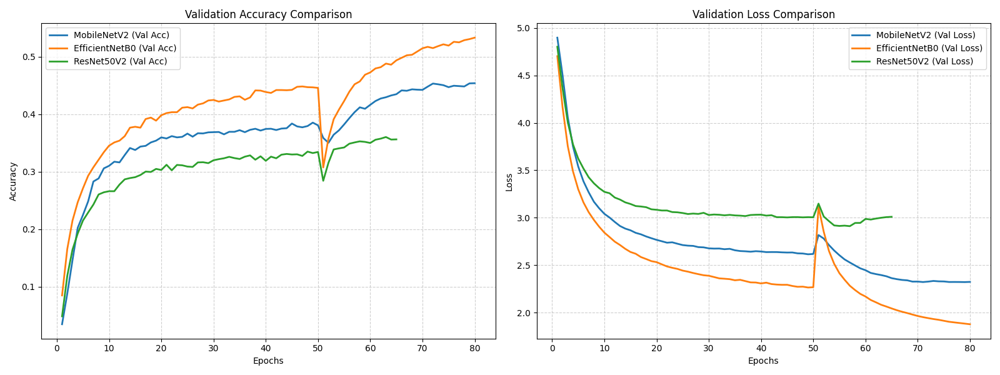

# ร่างบทความวิจัยสำหรับตีพิมพ์ในวารสารวิชาการ (Academic Research Paper Draft)

---

## 📄 ข้อมูลเบื้องต้นเกี่ยวกับบทความ (Metadata)
* **ชื่อบทความ (ภาษาไทย):** การเปรียบเทียบสถาปัตยกรรมโครงข่ายประสาทเทียมแบบคอนโวลูชันเพื่อจำแนกอัตลักษณ์พรรณไม้ท้องถิ่นที่พบในมหาวิทยาลัยราชภัฏวไลยอลงกรณ์ ในพระบรมราชูปถัมภ์
* **ชื่อบทความ (ภาษาอังกฤษ):** Comparison of Convolutional Neural Network Architectures for Local Plant Identity Classification in Valaya Alongkorn Rajabhat University under the Royal Patronage
* **ประเภทบทความ:** บทความวิจัย (Research Article)
* **กลุ่มเป้าหมายวารสาร:** วารสารวิทยาศาสตร์และเทคโนโลยี (TCI กลุ่ม 1 หรือ 2)

---

# [ร่างเนื้อหาบทความวิจัย]

## 1. บทคัดย่อ (Abstract)

### ภาษาไทย
งานวิจัยนี้มีวัตถุประสงค์เพื่อออกแบบระบบจำแนกอัตลักษณ์พรรณไม้ท้องถิ่นที่พบในมหาวิทยาลัยราชภัฏวไลยอลงกรณ์ ในพระบรมราชูปถัมภ์ โดยใช้วิธีการเรียนรู้เชิงลึก (Deep Learning) เพื่อสนับสนุนการศึกษาและการอนุรักษ์อย่างยั่งยืน คลังข้อมูลรูปภาพถูกจัดเตรียมขึ้นผ่านกระบวนการสืบค้นอัตโนมัติด้วย GBIF API โดยรวบรวมพืชท้องถิ่นจำนวน 166 ชนิด รวมทั้งสิ้น 15,891 ภาพ และใช้เทคนิคการปรับขนาดภาพแบบรักษาอัตราส่วนร่วมกับการเติมขอบว่าง (Letterbox Resizing with Padding) เพื่อลดการบิดเบี้ยวของภาพ งานวิจัยนี้ได้เปรียบเทียบประสิทธิภาพของสถาปัตยกรรมโครงข่ายประสาทเทียมแบบคอนโวลูชันที่ผ่านการเรียนรู้ล่วงหน้า (Pre-trained CNNs) จำนวน 3 สถาปัตยกรรม ได้แก่ MobileNetV2, EfficientNetB0 และ ResNet50V2 ภายใต้เงื่อนไขการเรียนรู้แบบถ่ายโอนค่าน้ำหนัก (Transfer Learning) ด้วยกระบวนการแช่แข็งโครงสร้างตัวสกัดฟีเจอร์ ร่วมกับการปรับแต่งเชิงลึก (Fine-Tuning) ผลการทดสอบพบว่าสถาปัตยกรรม **EfficientNetB0** ให้ประสิทธิภาพสูงสุด โดยมีค่าความแม่นยำบนชุดข้อมูลตรวจสอบ (Validation Accuracy) สูงสุดเท่ากับ **53.32%** และมีค่าความสูญเสียฝั่งทดสอบต่ำสุด (Min Val Loss) เท่ากับ **1.8781** (ปรับปรุงดีขึ้นจากขั้นตอนการแช่แข็งฟีเจอร์ที่ทำได้ 44.83% และความสูญเสีย 2.2653) ตามด้วย MobileNetV2 (45.40%) และ ResNet50V2 (36.04%) ตามลำดับ ผลลัพธ์ที่ได้สามารถนำไปพัฒนาเป็นเครื่องมืออำนวยความสะดวกในการระบุชนิดพรรณไม้เพื่อสนับสนุนกิจกรรมการศึกษาและเรียนรู้ทางพฤกษศาสตร์ในสถานศึกษา

**คำสำคัญ:** การเรียนรู้เชิงลึก, การจำแนกพรรณไม้ท้องถิ่น, การเรียนรู้แบบถ่ายโอน, การปรับแต่งเชิงลึก, มหาวิทยาลัยราชภัฏวไลยอลงกรณ์ ในพระบรมราชูปถัมภ์

---

### English
This research aims to design a local plant identity classification system for plant species found in Valaya Alongkorn Rajabhat University under the Royal Patronage using deep learning to support education and sustainable conservation. The dataset was constructed through an automated query pipeline using the GBIF API, capturing 15,891 images across 166 species. A letterbox resizing with padding technique was applied to preserve aspect ratios and mitigate shape distortion. We compared the performance of three pre-trained Convolutional Neural Network (CNN) architectures: MobileNetV2, EfficientNetB0, and ResNet50V2 using Transfer Learning with frozen feature extraction backbones, followed by fine-tuning of the base network layers. The experimental results demonstrated that **EfficientNetB0** achieved the highest performance, yielding a peak validation accuracy of **53.32%** and the lowest validation loss of **1.8781** (improved from 44.83% validation accuracy and 2.2653 validation loss during the feature extraction phase), followed by MobileNetV2 (45.40%) and ResNet50V2 (36.04%). The developed models can be utilized as tools to facilitate plant identification for botanical learning in educational institutions.

**Keywords:** Deep Learning, Local Plant Classification, Transfer Learning, Fine-Tuning, Valaya Alongkorn Rajabhat University under the Royal Patronage

---

## 2. บทนำ (Introduction)
มหาวิทยาลัยราชภัฏวไลยอลงกรณ์ ในพระบรมราชูปถัมภ์ ตั้งอยู่ในพื้นที่จังหวัดปทุมธานี ซึ่งเป็นบริเวณที่ราบลุ่มแม่น้ำเจ้าพระยาที่มีความหลากหลายทางชีวภาพของพรรณไม้สูง โดยมีพืชท้องถิ่นและพรรณไม้อัตลักษณ์ที่พบในบริเวณมหาวิทยาลัยและชุมชนรอบข้าง เช่น บัวหลวง และทองหลางลาย รวมถึงพืชเศรษฐกิจที่สำคัญ เช่น กล้วยหอมทองปทุม อย่างไรก็ตาม การระบุชนิดพันธุ์พืชโดยทั่วไปมักต้องอาศัยผู้เชี่ยวชาญด้านพฤกษศาสตร์ ซึ่งมีจำนวนจำกัดและใช้เวลานานในการตรวจสอบ ส่งผลให้องค์ความรู้เหล่านี้ไม่ได้รับการถ่ายทอดสู่ระดับชุมชนและการเรียนรู้ในสถานศึกษาอย่างทั่วถึง

การประยุกต์ใช้เทคโนโลยีปัญญาประดิษฐ์ในด้านคอมพิวเตอร์วิทัศน์ (Computer Vision) โดยเฉพาะโครงข่ายประสาทเทียมแบบคอนโวลูชัน (CNN) เข้ามามีบทบาทสำคัญในการช่วยจำแนกภาพพรรณไม้ได้อย่างแม่นยำและรวดเร็ว อย่างไรก็ตาม ปัญหาสำคัญในงานวิจัยจำแนกพืชของไทยคือการขาดแคลนชุดข้อมูลมาตรฐานที่มีการตรวจสอบอย่างถูกต้องและจัดเตรียมอย่างเหมาะสม นอกจากนี้ งานวิจัยส่วนใหญ่ยังเน้นเฉพาะประสิทธิภาพของโมเดล แต่ขาดมิติการต่อยอดองค์ความรู้เชิงสังคมหรือชุมชน

ดังนั้น งานวิจัยนี้จึงมุ่งพัฒนาระบบสืบค้นข้อมูลภาพพืชโดยใช้วิธีนำร่องแบบไฮบริดดึงข้อมูลจากแพลตฟอร์ม GBIF API พร้อมเปรียบเทียบสถาปัตยกรรมโมเดล Deep Learning ยอดนิยม 3 ชนิดที่เหมาะสำหรับการรันบนอุปกรณ์ขนาดเล็กและเซิร์ฟเวอร์คลาวด์ พร้อมทั้งออกแบบโครงสร้างการเชื่อมต่อผลลัพธ์ของโมเดลปัญญาประดิษฐ์เข้ากับระบบคลังข้อมูลภูมิปัญญาท้องถิ่นและพรรณไม้ในมหาวิทยาลัยราชภัฏวไลยอลงกรณ์ ในพระบรมราชูปถัมภ์ เพื่อตอบโจทย์การประยุกต์ใช้งานด้านการเรียนรู้และการอนุรักษ์พรรณไม้ในสถาบันการศึกษาและชุมชนอย่างเป็นรูปธรรม

---

## 3. ระเบียบวิธีวิจัย (Methodology)

### 3.1 การรวบรวมและจัดเตรียมชุดข้อมูล (Data Acquisition & Pipeline)
1. **การดึงข้อมูลจากแหล่งเปิดสาธารณะ:** คัดกรองรายชื่อพืชพรรณท้องถิ่นที่พบในมหาวิทยาลัยราชภัฏวไลยอลงกรณ์ ในพระบรมราชูปถัมภ์ จำนวน 166 ชนิดพันธุ์ นำมาสืบค้นภาพผ่าน GBIF API
2. **การจำกัดปริมาณข้อมูล (Capping):** ทำการจำกัดจำนวนภาพสูงสุดไว้ไม่เกิน 100 ภาพต่อคลาส เพื่อหลีกเลี่ยงปัญหาความไม่สมดุลของข้อมูล (Class Imbalance) อย่างไรก็ตาม เนื่องจากพืชบางชนิดในระบบฐานข้อมูล GBIF มีจำนวนรูปภาพจำกัดและไม่ถึง 100 ภาพ จึงสืบค้นรูปภาพตามจำนวนที่มีจริง ส่งผลให้ได้ชุดข้อมูลเริ่มต้นรวมทั้งสิ้น 15,891 ภาพ จากพืชทั้งหมด 166 ชนิด
3. **การประมวลผลรูปภาพล่วงหน้า (Preprocessing):** นำภาพทั้งหมดเข้าสู่กระบวนการ **Letterbox Resize with Padding** ปรับสัดส่วนภาพให้เป็นขนาดสี่เหลี่ยมจัตุรัส $224 \times 224$ พิกเซล เพื่อไม่ให้รูปทรงธรรมชาติของใบและดอกไม้บิดเบี้ยว

### 3.2 สถาปัตยกรรมโมเดลและการฝึกสอน (Model Architectures & Training)
งานวิจัยนี้เลือกใช้การเรียนรู้แบบถ่ายโอน (Transfer Learning) จากน้ำหนักที่ฝึกสอนด้วย ImageNet โดยเปรียบเทียบโครงข่าย 3 รูปแบบ:
*   **MobileNetV2:** สถาปัตยกรรมน้ำหนักเบาที่ใช้หลักการ Depthwise Separable Convolution เหมาะสำหรับอุปกรณ์เคลื่อนที่
*   **EfficientNetB0:** โมเดลที่ใช้วิธี Compound Scaling ในการปรับความกว้าง ความลึก และความละเอียดของภาพอย่างเป็นระบบ ร่วมกับหน่วยประมวลผล Squeeze-and-Excitation
*   **ResNet50V2:** โครงข่ายที่ใช้กลไกข้ามเลเยอร์ (Residual Connections) รุ่นปรับปรุง ช่วยลดปัญหา Gradient Vanishing ในโมเดลลึก

ในการวิจัยรอบเริ่มต้นนี้ ได้ทำการแช่แข็งน้ำหนักของโมเดลฐาน (`base_model.trainable = False`) และฝึกสอนเฉพาะชั้นจำแนกประเภท (Fully Connected Head) ที่เชื่อมต่อเพิ่ม ได้แก่ Global Average Pooling 2D, Dropout (0.5), Dense (256) และ Dense Classifier (166 คลาส พร้อม Softmax)

### 3.3 พารามิเตอร์และสภาวะแวดล้อมในการทดลอง
*   **Optimizer:** Adam พร้อมอัตราการเรียนรู้คงที่ (Learning Rate) เท่ากับ $10^{-4}$
*   **Batch Size:** 32 (จัดสรรการประมวลผลสำหรับ GPU T4)
*   **สัดส่วนข้อมูล:** แบ่งรูปภาพเป็นชุดฝึกสอน (Train) 80% และชุดทดสอบ (Validation) 20%
*   **ระบบควบคุม (Callbacks):** 
    *   `EarlyStopping` สั่งหยุดเทรนเมื่อ Validation Loss ไม่ลดลงติดต่อกันเป็นเวลา 10 Epochs
    *   `ReduceLROnPlateau` ปรับลดค่าการเรียนรู้ลง 5 เท่าเมื่อเจอจุดติดขัด

---

## 4. ผลการทดลองและอภิปรายผล (Results and Discussion)

การทดลองแบ่งออกเป็น 2 ขั้นตอนหลัก ได้แก่ (1) ขั้นตอนการสกัดคุณลักษณะ (Feature Extraction) โดยตรึงค่าน้ำหนักของโมเดลฐานทั้งหมด และฝึกสอนเฉพาะส่วนจำแนกประเภท (Classification Head) เป็นจำนวน 50 Epochs และ (2) ขั้นตอนการปรับแต่งเชิงลึก (Fine-Tuning) โดยปลดล็อกพารามิเตอร์โครงข่ายฐานบางส่วนเพื่อยกระดับความแม่นยำเพิ่มเติมอีกเป็นเวลา 15-30 Epochs (ขึ้นอยู่กับประสิทธิภาพและการทำงานของระบบตรวจสอบการลู่เข้า Early Stopping)

ผลการทดสอบเปรียบเทียบประสิทธิภาพของโมเดลทั้ง 3 รุ่น ในทั้งสองขั้นตอนบันทึกได้ดังตารางที่ 1:

**ตารางที่ 1:** เปรียบเทียบผลลัพธ์ประสิทธิภาพของสถาปัตยกรรมโมเดล Deep Learning ในขั้นตอนการสกัดคุณลักษณะ (Feature Extraction) และการปรับแต่งเชิงลึก (Fine-Tuning)

| สถาปัตยกรรมโมเดล (Model Architecture) | ขั้นตอนการฝึกสอน (Training Phase) | ค่าความแม่นยำชุดฝึกสอน (Max Train Acc) | ค่าความแม่นยำชุดตรวจสอบ (Max Val Acc) | ค่าความสูญเสียต่ำสุด (Min Val Loss) |
| :--- | :--- | :---: | :---: | :---: |
| **MobileNetV2** | Feature Extraction (Epoch 1-50) Fine-Tuning (Epoch 51-80) | 54.06% **77.87%** | 38.54% **45.40%** | 2.6152 **2.3223** |
| **EfficientNetB0** | Feature Extraction (Epoch 1-50) Fine-Tuning (Epoch 51-80) | 57.13% **70.95%** | 44.83% **53.32%** | 2.2653 **1.8781** |
| **ResNet50V2** | Feature Extraction (Epoch 1-50) Fine-Tuning (Epoch 51-65) | 56.31% **90.66%** | 33.50% **36.04%** | 3.0036 **2.9116** |

### 4.1 อภิปรายผลประสิทธิภาพของสถาปัตยกรรม
ผลลัพธ์แสดงให้เห็นว่าในขั้นตอนการสกัดคุณลักษณะ (Feature Extraction) **EfficientNetB0** สามารถทำค่าความแม่นยำสูงที่สุดบนชุดทดสอบ Validation อยู่ที่ **44.83%** และมีอัตราความสูญเสียต่ำที่สุด ซึ่งสอดคล้องกับคุณลักษณะเด่นของสถาปัตยกรรมปัญญาประดิษฐ์ที่มีฟังก์ชันปรับน้ำหนักสมดุลระหว่างโครงข่ายที่มีความซับซ้อนต่ำ ในขณะที่ **ResNet50V2** แม้จะมีขนาดใหญ่แต่ความแม่นยำกลับต่ำสุดที่ **33.50%** เนื่องจากตัวดึงคุณลักษณะที่ผ่านการตรึงค่าน้ำหนักไว้ไม่ยืดหยุ่นเพียงพอที่จะใช้จำแนกรายละเอียดของพรรณไม้ที่พบในมหาวิทยาลัยราชภัฏวไลยอลงกรณ์ ในพระบรมราชูปถัมภ์ ที่มีลักษณะใบและดอกที่มีลักษณะทางกายภาพคล้ายคลึงกัน (Fine-grained categories)

หลังจากผ่านการทำ **Fine-Tuning** ปลดล็อกเลเยอร์ฐานบางส่วน (ตั้งแต่ Epoch 51 เป็นต้นไป) ทุกโมเดลมีประสิทธิภาพที่สูงขึ้นอย่างมีนัยสำคัญ:
*   **EfficientNetB0** ยังคงรักษาอันดับหนึ่งด้วยค่าความแม่นยำสูงสุดที่ **53.32%** (เพิ่มขึ้น +8.49%) และลดค่าความสูญเสียชุดตรวจสอบลงเหลือ **1.8781**
*   **MobileNetV2** สามารถปรับปรุงค่าความแม่นยำขึ้นมาได้เป็น **45.40%** (เพิ่มขึ้น +6.86%) และค่าความสูญเสียต่ำสุดอยู่ที่ **2.3223**
*   **ResNet50V2** มีค่าความแม่นยำชุดตรวจสอบดีขึ้นเล็กน้อยเป็น **36.04%** (เพิ่มขึ้น +2.54%) อย่างไรก็ตาม โมเดลเกิดปัญหากลุ่มอาการ Overfitting อย่างรวดเร็วในขั้นตอนนี้ โดยค่าความแม่นยำชุดฝึกสอนพุ่งสูงขึ้นถึง **90.66%** แต่ความแม่นยำชุดตรวจสอบหยุดการพัฒนา ทำให้ระบบ Early Stopping ทำการยุติการฝึกสอนที่ Epoch 65 (หลังเข้าสู่ขั้นตอน Fine-Tuning เพียง 15 Epochs)

ภาพรวมการทดลองนี้ยืนยันว่าการปลดล็อกเลเยอร์ส่วนล่างช่วยกระตุ้นความสามารถของโมเดลในการปรับตัวเข้ากับโดเมนพรรณไม้ของมหาวิทยาลัยราชภัฏวไลยอลงกรณ์ ในพระบรมราชูปถัมภ์ ที่เป็นชุดข้อมูลเฉพาะถิ่นได้ดีกว่าการตรึงค่าน้ำหนักเพียงอย่างเดียว

### 4.2 การวิเคราะห์เชิงลึกและข้อจำกัดของการวิจัย (In-depth Analysis and Limitations)
1. **การวิเคราะห์ประสิทธิภาพความแม่นยำ:** แม้ค่าความแม่นยำในการตรวจสอบสูงสุดของ EfficientNetB0 จะอยู่ที่ **53.32%** ซึ่งดูปานกลาง แต่ถือว่าพัฒนาขึ้นอย่างมีนัยสำคัญเมื่อเทียบกับการเดาสุ่มสำหรับโจทย์จำแนกประเภทที่มีมากถึง 166 คลาส (ซึ่งมีโอกาสถูกเพียงประมาณ $1/166 \approx 0.6\%$) ความท้าทายหลักเกิดจากลักษณะของพรรณไม้ที่มีโครงสร้างกิ่ง ใบ และดอกคล้ายคลึงกันมากข้ามสายพันธุ์ (High Inter-class Similarity) ทำให้โมเดลจำแนกได้ยาก
2. **การ Overfitting ของ ResNet50V2:** ปัญหาที่ประสิทธิภาพชุดตรวจสอบของ ResNet50V2 ต่ำกว่าชุดฝึกสอนอย่างมาก (Train Acc 90.66% vs Val Acc 36.04%) มีสาเหตุจาก ResNet50V2 เป็นโมเดลที่มีขนาดพารามิเตอร์ใหญ่มาก (~25.6 ล้านพารามิเตอร์) เมื่อเทียบกับสถาปัตยกรรมขนาดเล็กอย่าง MobileNetV2 (~3.5 ล้านพารามิเตอร์) และ EfficientNetB0 (~5.3 ล้านพารามิเตอร์) เมื่อฝึกสอนด้วยชุดข้อมูลที่มีจำนวนรูปต่อคลาสจำกัด (ไม่เกิน 100 ภาพ) โมเดลขนาดใหญ่จึงเกิดการจดจำข้อมูลฝึกสอน (Memorization) มากกว่าการสกัดลักษณะเด่นเพื่อการจำแนกภาพทั่วไป
3. **ข้อจำกัดเรื่องคุณภาพข้อมูลภาพออนไลน์:** รูปภาพที่ดึงผ่าน GBIF API เป็นคลังภาพสากลที่มีสภาพแสง แสงเงา มุมกล้อง และฉากหลังที่หลากหลายมาก รวมถึงอาจมีความคลาดเคลื่อนของสายพันธุ์ย่อยบางชนิดที่ไม่ตรงกับลักษณะกายภาพของพืชในประเทศไทยหรือในมหาวิทยาลัย การนำเทคนิคการเพิ่มข้อมูลด้วยโปรแกรม (Data Augmentation) มาใช้ร่วมกับการคัดกรองรูปภาพโดยผู้เชี่ยวชาญด้านพฤกษศาสตร์ในพื้นที่ จึงมีความจำเป็นต่อการยกระดับประสิทธิภาพความแม่นยำในงานวิจัยเฟสถัดไป

---

## 5. สรุปผลและข้อเสนอแนะ (Conclusion and Future Work)

### 5.1 สรุปผลการทดลอง
งานวิจัยนี้บรรลุการเปรียบเทียบประสิทธิภาพในการใช้ Transfer Learning ร่วมกับ Fine-Tuning เพื่อจำแนกพันธุ์พืชท้องถิ่นที่พบในมหาวิทยาลัยราชภัฏวไลยอลงกรณ์ ในพระบรมราชูปถัมภ์ จำนวน 166 ชนิด โมเดล **EfficientNetB0** ให้ประสิทธิภาพที่ดีที่สุดในบรรดาสถาปัตยกรรมที่ทดสอบทั้งหมด โดยให้ความแม่นยำสูงสุดในชุดตรวจสอบที่ **53.32%** และความสูญเสียต่ำสุดที่ **1.8781** ภายหลังการปรับแต่งเชิงลึก (Fine-Tuning) ผลลัพธ์ดังกล่าวแสดงให้เห็นว่าการปลดล็อกพารามิเตอร์โครงข่ายฐานบางส่วนร่วมกับชุดข้อมูลที่ผ่านกระบวนการจัดการปัญหาอัตราส่วนภาพด้วย Letterbox Resizing ช่วยขยายขีดความสามารถการทำนายภาพของโมเดลสำหรับการจำแนกพรรณไม้ท้องถิ่นได้อย่างมีประสิทธิภาพ เพื่อต่อยอดสู่การพัฒนาเครื่องมือสนับสนุนการเรียนรู้ทางพฤกษศาสตร์ต่อไป

### 5.2 ข้อเสนอแนะในอนาคต
1.  **การปรับปรุงสถาปัตยกรรมและเทคนิค Data Augmentation เพิ่มเติม:** ประยุกต์ใช้เทคนิคการเพิ่มข้อมูลด้วยโปรแกรม (เช่น Random Augmentation) หรือปรับเปลี่ยนโครงข่ายที่มีความซับซ้อนสูงขึ้น (เช่น Vision Transformers หรือ EfficientNet รุ่นที่สูงขึ้น) เพื่อแก้ไขกลุ่มอาการ Overfitting ของ ResNet50V2 และยกระดับความแม่นยำของ EfficientNetB0 ขึ้นสู่ระดับที่เสถียรยิ่งขึ้น
2.  **การพัฒนาเครื่องมือสืบค้นแบบพกพา:** พัฒนาและแปลงไฟล์เป็นโมเดลสำหรับแพลตฟอร์มน้ำหนักเบา (TensorFlow Lite) เพื่อใช้งานในรูปแบบแอปพลิเคชันบนอุปกรณ์พกพา สำหรับอำนวยความสะดวกในการเรียนรู้และการระบุพรรณไม้ในระดับสถาบันศึกษา

---

## 6. เอกสารอ้างอิง (References)
*(ตัวอย่างรูปแบบการเขียนอ้างอิงสำหรับวารสาร)*
1.  Sandler, M., Howard, A., Zhu, M., Zhmoginov, A., & Chen, L. C. (2018). Mobilenetv2: Inverted residuals and linear bottlenecks. In *Proceedings of the IEEE conference on computer vision and pattern recognition* (pp. 4510-4520).
2.  Tan, M., & Le, Q. (2019). Efficientnet: Rethinking model scaling for convolutional neural networks. In *International conference on machine learning* (pp. 6105-6114). PMLR.
3.  He, K., Zhang, X., Ren, S., & Sun, J. (2016). Deep residual learning for image recognition. In *Proceedings of the IEEE conference on computer vision and pattern recognition* (pp. 770-778).
